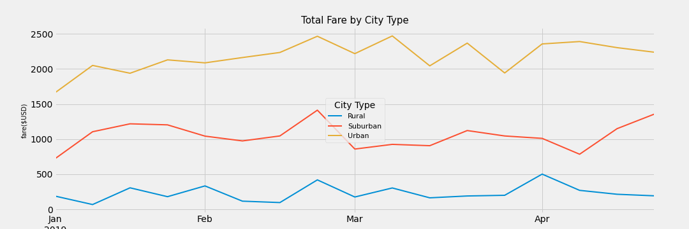

# PyBer Analysis Report

## Background and Results
To Indentify trends and disparties between urban, suburaban and rural  Pyber customers. Using the ridesharing data the following analysis was completed
# Technical Analysis 1
* Create a DataFrame of customers by city type, sort the total drivers, total rides, average fare per ride and average fare per driver.
# Technical Analysis 2
* Edit and create DatFrames to be able to sort total fare by city type for each week for a four month period beginning in Janaury and ending in April.
* Create a multi-line bar chart using the fiverthiryeight method

### Purpose
#Presentation for CEO of Pyber 

### Technical Analysis
* For technical analysis 1 - Create DataFrame utilizing the previoulsy merged DataFrame pyber_data_df to find by city type, sort the total drivers, total rides, average fare per ride and average fare per driver. Then utilizing the groupby() functionality create a summary data frame from the inofmation derived from above. Format. 
* For techincal analysis 2 - rename columns from pyber_data_df DataFrame , utilize the copy method to create a new DataFrame a choosing only three columns, Date, Fare and City Type. Format so that city type is in the columns, fare and dates in the rows. Utlizing groupby()find sum of fares by city type and date. Convert that to a DataFrame using pd.pivot_table. Create an additional DataFrame using loc for the dates beginning in Janaury and ending in April. Then using resample found the weekly bins and calculated the sum of fares. 

### Results 
* Technical Analysis 1
  * 
  
* Technical Analysis 2
  * 

### Summary
While total fares for urban and suburban where higher than rural, so where the number of rides. The average fare for rural rideshare is higher compared to suburban and urban. 

## Challenges Encountered and Overcome
Had difficulty creating the data frame utilizing the pd.pivot_table was able to get help duting office hours.
Also had an error in my map code that caused the png to save blank. Was able to overcome that by condensing the code. 
Had many times were I began to write code , did undid, redid . Lots of trial and error.Also started from the bootm of the module assigment and in hindsight I should have started a new work both with the code up to the merged DataFrame. It would have been easier to manage

## Recommendations and Next Steps

I would reccomend that futher statistics such as mileage be reviewed to help see if trip distance is a component of higher fares in rural areas. Many times rural and suburban areas have greater distances between point A and point B. 

### Recommendations for Future Analysis

### Additional Analysis 1

* Description of Approach
* Gather mileage data and sort by city type, and driver, and ride_id and fare
* Calculate average mileage by driver for city type , and average fare per mile by city type and sum 
* Technical Steps
* Create a DataFrame with the above date using groupby() and sum, then format 

### Additional Analysis 2

* Description of Approach
* Look at times of day , create bins , and see if there are trends betweens fares, city type and times of day
* Technical Steps
* Create a DataFrame with the above date using groupby() and sum, then format 
* Use loc to create time of day categories
* Use the resample to create bins within the time of day categories
* Map utilizing the fivethirtyeight map
  
  
